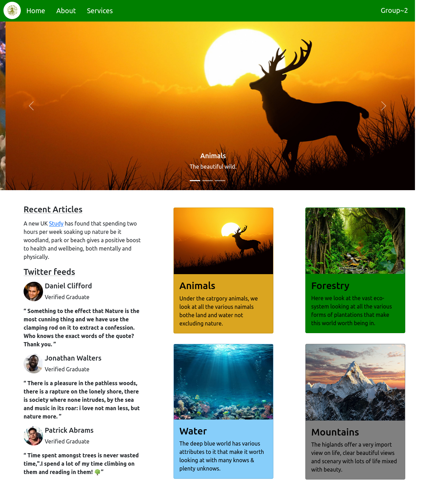

# Tusimbude Responsive website
> This project is a small blog built to demostrate the Group's learned knowledge of HTML5,CSS3,BootStrap and responsive design.


## Screenshot


>This project was made to demonstrate the group's understanding of basic HTML5,CSS3 and Bootstrap concepts; 
The ability to work with Bootstrap and portrayal of our understanding of responsive designs of a webpage.

## Built With
- HTML
- CSS
- Bootstrap

## Live Demo 
[Live Link](https://rawcdn.githack.com/Ddiiro/Group-2/0b9295acc3c5e23d217a3355f06c5048b97592e9/index.html)

## Getting Started
To get a local copy of this repository, please run the following commands on your terminal

```
$ cd <folder>(This is a folder of your choice)
```

```
$ git clone git@github.com:Ddiiro/Group-2.git
```

```
cd in to <Group-2> folder and Open the index.html file in a browser of your choice.
```

## Authors/Team members

👤 **Racheal Nakalawa**
👤 **Ddiiro Joseph**
👤 **Male Joseph**
👤 **Naggayi Daphne Pearl**
👤 **Alwoch Sophia**
👤 **Kigozi Moses Nasuldine**


# 🤝 Contributing

Contributions, issues and feature requests are welcome!

Feel free to check the [issues page](https://github.com/Ddiiro/Group-2/issues).

## Show your support

Give a ⭐️ if you like this project!

## Acknowledgments

- This project was inspired by teachings of Mr Samson Kapeyi
